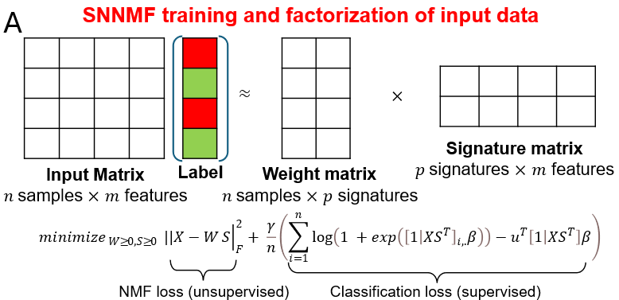

## This is a implementation of the paper *[Supervised non-negative matrix factorization on cell-free DNA fragmentomic features enhances early cancer detection]*


#### Environment
- Python 3.8.10

#### Structure


#### Traning

```bash
singularity run \
  --bind /path/to/supervisednmf:/supervisednmf \
  /path/to/supervisednmf/resource/SNMF.img bash

cd /supervisednmf

python3 src/SNMF_training.py \
    --feature_path input/test/FLEN/feature.csv \
    --meta_path input/test/meta.csv \
    --meta_path_val input/test/meta_val.csv \
    --nmf_init_mode random \
    --rank 2 \
    --iter 15000 \
    --tolerance 1e-08 \
    --patience 15 \
    --alpha 0.9 \
    --epsilon 1e-06 \
    --output_path output/FLEN
```

  - `feature_path`: Path to the feature file
  - `meta_path`: Path to the train meta file
  - `meta_path_val`: Path to the validation meta file
  - `nmf_init_mode`: How to initialize SNMF
  - `rank`: Number of dims of transformed data
  - `iter`: Number of iteractions
  - `tolerance`: Tolerance in early stopping
  - `patience`: Patience in early stopping
  - `alpha`: Alpha in ADADELTA
  - `epsilon`: Epsilon in ADADELTA
  - `output_path`: Path to the output directory


#### Transforming

```bash
python3 src/SNMF_transforming.py \
    --feature_path input/test/FLEN/feature.csv \
    --meta_path input/test/meta_full.csv \
    --nmf_init_mode random \
    --rank 2 \
    --iter 15000 \
    --tolerance 1e-08 \
    --patience 15 \
    --alpha 0.9 \
    --epsilon 1e-06 \
    --input_path output/FLEN \
    --output_path output/FLEN
```
  - `feature_path`: Path to the feature file
  - `meta_path`: Path to the full meta file
  - `nmf_init_mode`: How to initialize SNMF
  - `rank`: Number of dims of transformed data
  - `iter`: Number of iteractions
  - `tolerance`: Tolerance in early stopping
  - `patience`: Patience in early stopping
  - `alpha`: Alpha in ADADELTA
  - `epsilon`: Epsilon in ADADELTA
  - `input_path`: Path to the SNMF output directory
  - `output_path`: Path to the output directory